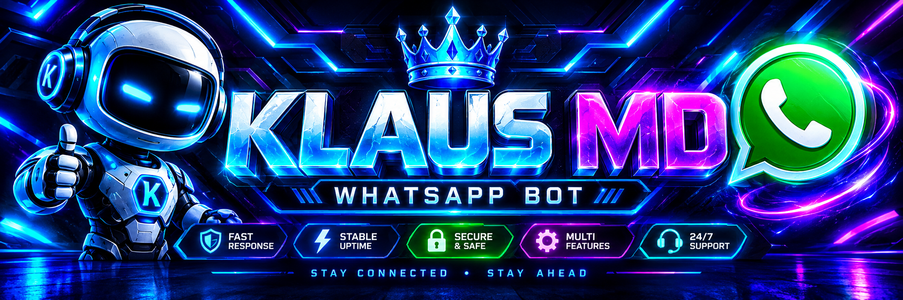

<div align="center">



# ⚡ KLAUS MD BOT

*"The fire that lights the night."*

Premium WhatsApp Bot · AI Chat · Auto-Session · Pair Link Web

---

<!-- Action buttons -->
<a href="https://klausmd.pairsite.space">
  
</a>
&nbsp;
<a href="https://railway.app/new">
  
</a>
&nbsp;
<a href="https://render.com/deploy?repo=https://github.com/Luffy-ui21/Klaus-Bot">
  
</a>
&nbsp;
<a href="https://heroku.com/deploy?template=https://github.com/Luffy-ui21/Klaus-Bot">
  
</a>
&nbsp;
<a href="https://github.com/Luffy-ui21/Klaus-Bot/archive/refs/heads/main.zip">
  
</a>

---


</div>

---

## Quick Start

```bash
git clone https://github.com/Luffy-ui21/Klaus-Bot.git
cd Klaus-Bot
npm install
npm start
```

When prompted, choose `1` → enter your phone → get an 8-char code → open WhatsApp → **Settings → Linked Devices → Link a Device → Link with phone number instead** → type the code.

## Config

```env
BOT_NAME="KLASU MD"
OWNER_NUMBER=254711815459
SESSION_ID=
BOT_PREFIX=.
BOT_MODE=public
XWOLF_API_KEY=wxa_u_xwk7sch6xj
```

## Commands

```
.menu          .ping          .chatgpt
.gemini        .claudeai      .deepseek
.sessionid     .translate     .wiki
.ytv           .facebook      .chess
```

---

<div align="center">

**⚡ KLAUS MD BOT — Powered by Klaus Labs**

</div>
